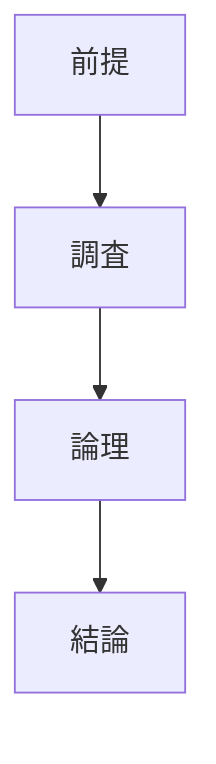

# pattern-research パターン - 調査分析構造ガイド

## 定義と特徴

pattern-research は、**外部情報の調査・分析により設計判断を導出する**ファイル構造パターンです。外部データソースから情報を取得し、論理的分析を通じて結論を導出することが特徴です。

## いつ使うのか

- 外部データソース(調査レポート、統計データなど)の分析が必要な場合
- 技術動向や市場動向の調査に基づく設計判断
- 複数の情報源を組み合わせた総合的な分析
- データに基づく客観的な技術選択

**重要**: 単純な選択肢比較は `pattern-choice` を、純粋な論理推論は `pattern-logic` を使用してください。

## 他パターンとの違い

- **pattern-research**: 外部データの調査・分析により判断を導出
- **pattern-logic**: 純粋な論理的推論により判断を導出
- **pattern-choice**: 複数選択肢の体系的比較により最適解を選択

## 構造定義



### 各セクションの役割

1. **前提** - 調査の前提条件と制約の明確化
2. **調査** - 外部データソースからの情報収集と基礎分析
3. **論理** - 調査結果に基づく段階的な論理展開
4. **結論** - 1 つの明確な判断結果

### 前提セクションの要件

前提セクションには以下を含める必要があります：

- **他設計書との接続点**: 前提とする他の設計判断
- **調査制約**: 利用可能なデータソースと制約条件
- **判断基準**: この判断で重視する原則や指標
- **スコープ境界**: 調査対象の範囲と除外項目の明確化

### 調査セクションの要件

調査セクションは**外部データの収集と基礎分析**を記述し、客観的なデータ収集に徹して解釈や判断は論理セクションで行う。

- **調査対象と情報源**: 使用したデータソース(URL、調査名等)の明記、分析対象の技術・手法・サービス等の列挙、調査から除外した項目とその理由を記載する
- **選択基準と評価方法**: 以下の 3 軸評価を基本とし、調査対象を絞り込む場合は基準と理由を明確に記載し、使用率や情報の豊富さではなく技術的適合性を評価基準とする
  - シェアが高い（常に調査対象）
  - 満足度が高い（要件マッチ度が高い場合のみ調査対象）
  - 要件マッチ度が高い（常に調査対象）
- **データの客観的処理**: 収集したデータは客観的事実のみを記載し、データソースの項目構成や表現形式をそのまま使用して体系的な整理と分類を行う

### 論理セクションの要件

論理展開は**必ず文章で記述**し、調査結果に基づく分析構造を推奨：

- **第一に**: 調査データから読み取れる基本的な傾向や特徴
- **第二に**: 前提条件との照合と適合性の分析
- **第三に**: 制約条件下での最適解の論証
- **必要に応じて第四に、第五に**: より複雑な分析の場合

**重要**: 調査データを根拠とした客観的な論理展開を心がけ、推測や憶測は避けてください。

### 結論セクションの要件

結論は**1 つの明確な判断結果**のみを記述：

- 調査に基づく技術・手法の選択結果
- 採用・除外する項目の明確な判断
- 複数の判断を含めない(分割が必要)

## 圏論的解釈

外部環境を始域 `E`、調査プロセスを効果付き射 `f: E → T(D)`、論理分析を射 `g: D → C` とする合成 `E → T(D) → C` として表現される。ここで `T` は調査の副作用を表すモナド、環境依存性はコモナドで表現される。

## テンプレート構造

```markdown
---
doc_type: "pattern-research"
category: "[カテゴリ名]"
---

# [調査対象名]

## 前提

<!-- 他文書からの前提条件をマーカーで継承 -->

## 調査

### 情報源

[使用したデータソース(URL、調査名等)]

### [データ分類 1]

[収集したデータの体系的な整理]

### [データ分類 2]

[収集したデータの体系的な整理]

## 論理

[調査結果に基づく段階的な論理展開を文章で記述]

## 結論

<!-- GLOBAL_CONCLUSION_BEGIN: example -->

[調査に基づく 1 つの明確な判断結果]

<!-- GLOBAL_CONCLUSION_END: example -->
```

## 品質チェックリスト

### 必須要素

- [ ] 前提が明確に記述されている
- [ ] 外部データソースが明示されている
- [ ] 調査結果が客観的に整理されている
- [ ] 論理が調査データに基づいて文章で展開されている
- [ ] 結論が 1 つの明確な判断結果になっている
- [ ] 1 ファイル 1 判断原則が守られている

### 構造チェック

- [ ] doc_type が "pattern-research" になっている
- [ ] 前提 → 調査 → 論理 → 結論の順序になっている

### 内容チェック

- [ ] 調査データが客観的で検証可能である
- [ ] 論理展開が調査結果に基づいている
- [ ] 箇条書きでなく文章で論理が展開されている
- [ ] 結論が前提・調査・論理から自然に導出されている

### 調査セクション特有チェック

- [ ] データソースの形式をそのまま使用している
- [ ] フィルタリング基準が明示されている
- [ ] 技術的適合性で評価している
- [ ] 3 軸評価（シェア・満足度・要件マッチ度）が適用されている
- [ ] 客観的事実のみを記載している
