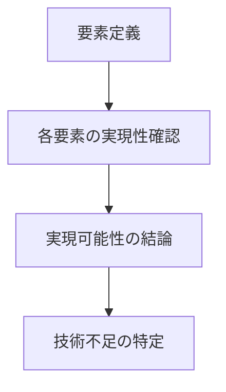

# pattern-scenario-validate パターン - シナリオ実現可能性検証ガイド

## 定義と特徴

pattern-scenario-validate は、**シナリオの実現可能性を 4+1 View の設計結論から検証する**ファイル構造パターンです。シナリオの各要素が Logical View、Process View、Development View、Physical View の設計結論で実現可能かを確認し、技術不足を特定することが特徴です。

## いつ使うのか

- シナリオの実装可能性を技術的に検証する場合
- シナリオ要素ごとに必要な設計結論を抽出する場合
- 技術不足や設計の欠落を洗い出す必要がある場合
- 実装開始前の最終確認として実現可能性を評価する場合

**重要**: このパターンは Scenario View 専用であり、他の View での実現可能性検証には使用しません。

## 他パターンとの違い

- **pattern-scenario-validate**: シナリオの実現可能性を 4+1 View から検証
- **pattern-process-technology-mapping**: Process 制約の技術適用と適合性検討
- **pattern-logic**: 論理的推論による設計判断

## 構造定義



### 各セクションの役割

1. **要素定義** - シナリオの UI 要素とシステム処理フローの定義
2. **各要素の実現性確認** - 要素ごとに 4+1 View から必要な設計結論を抽出
3. **実現可能性の結論** - View ごとの結論と総合評価
4. **技術不足の特定** - 不足している技術要素の明確化

## テンプレート構造

````markdown
---
doc_type: "pattern-scenario-validate"
status: "draft"
depends:
  contracts: []
  produces: []
---

# [シナリオ名]の実現可能性確認

## 要素定義

### UI 要素

<!-- PREMISE_BEGIN: example-scenario-ui-elements -->

1. **[UI 要素 1]** - [説明]
2. **[UI 要素 2]** - [説明]
3. **[UI 要素 3]** - [説明]

<!-- PREMISE_END: example-scenario-ui-elements -->

### システム処理フロー

<!-- PREMISE_BEGIN: example-scenario-workflow -->

- **目的**: [ワークフローの目的]
- **トリガ**: [開始条件]
- **終了条件**: [完了条件]
- **境界越え**: [外部 API やサービス]

  ```mermaid
  flowchart TD
      A[開始] --> B[処理1]
      B --> C[処理2]
      C --> D[終了]
  ```

<!-- PREMISE_END: example-scenario-workflow -->

## 各要素の実現性確認

### [UI 要素 1]

[要素の説明と実現に必要な設計結論を 4+1 View から抽出する目的の説明]

- Logical View
  - [必要な設計結論 1] (`marker-name`)
  - [必要な設計結論 2] (`marker-name`)
- Process View
  - [必要な設計結論 1] (`marker-name`)
  - [必要な設計結論 2] (`marker-name`)
    - [ネストした詳細 1]
    - [ネストした詳細 2]
- Development View
  - [必要な設計結論 1] (`marker-name`)
    - [技術 1]
    - [技術 2]
  - **[技術不足]**: [不足している技術の説明]
- Physical View
  - [必要な設計結論 1] (`marker-name`)
    - [配置詳細 1]
    - [配置詳細 2]

### [UI 要素 2]

[要素の説明と実現に必要な設計結論を 4+1 View から抽出する目的の説明]

- Logical View
  - [必要な設計結論]
- Process View
  - [必要な設計結論]
- Development View
  - [必要な設計結論]
- Physical View
  - [必要な設計結論]

### [ワークフロー全体]

[ワークフロー全体の説明と実現に必要な設計結論を 4+1 View から抽出する目的の説明]

- Logical View
  - [画面統合、データフロー、状態管理等の設計結論]
- Process View
  - [サービス間協調、データ整合性、通信設計等の設計結論]
- Development View
  - [技術スタック、状態管理方針、パフォーマンス方針等の設計結論]
- Physical View
  - [配置、環境構成、データベース等の設計結論]

## 実現可能性の結論

[シナリオ名]の実現可能性を、Logical View、Process View、Development View、Physical View の観点から総合的に評価する。

### Logical View の結論

[シナリオ名]の実現に必要な論理設計は[完全に定義されている/一部不足がある]。

- [論理設計の状態 1]
- [論理設計の状態 2]
- [論理設計の状態 3]

**結論**: 論理設計の観点から[実現可能である/課題がある]。

### Process View の結論

[シナリオ名]の実現に必要なプロセス設計は[完全に定義されている/一部不足がある]。

- [プロセス設計の状態 1]
- [プロセス設計の状態 2]
- [プロセス設計の状態 3]

**結論**: プロセス設計の観点から[実現可能である/課題がある]。

### Development View の結論

[シナリオ名]の実現に必要な開発技術は[概ね選択済みだが一部技術不足が存在する/完全に選択済みである]。

- [技術スタックの状態 1]
- [技術スタックの状態 2]
- [技術スタックの状態 3]

**技術不足**:

- [不足技術 1]([具体例])の選択が未決定
- [不足技術 2]([具体例])の選択が未決定

**結論**: [技術不足を解消すれば/すでに]実現可能である。

### Physical View の結論

[シナリオ名]の実現に必要な物理配置は[完全に定義されている/一部不足がある]。

- [物理配置の状態 1]
- [物理配置の状態 2]
- [物理配置の状態 3]

**結論**: 物理配置の観点から[実現可能である/課題がある]。

### 総合結論

[シナリオ名]は、以下の[技術不足を解消すれば/条件で]実現可能である。

**必要な追加技術選択**:

1. [不足技術 1]の選択([具体例])
2. [不足技術 2]の選択([具体例])

**その他の問題**: [なし/以下の問題がある]

全ての設計観点から必要な結論が揃っており、技術的な阻害要因は[存在しない/限定的である]。[上記の技術選択を完了すれば/そのまま]、[シナリオ名]の実装を開始できる状態である。

```

## 品質チェックリスト

### 必須要素

- [ ] PREMISE マーカーで UI 要素一覧が設置されている
- [ ] PREMISE マーカーでシステム処理フローが設置されている
- [ ] 各要素ごとに 4+1 View からの設計結論抽出がある
- [ ] ワークフロー全体の設計結論抽出がある
- [ ] 4+1 View それぞれの結論が記述されている
- [ ] 総合結論が記述されている

### 構造チェック

- [ ] doc_type が "pattern-scenario-validate" になっている
- [ ] H2 見出しが「要素定義」「各要素の実現性確認」「実現可能性の結論」の 3 つになっている
- [ ] 各要素が H3 見出しになっている
- [ ] 設計結論は「- View 名」のリスト形式になっている

### 内容チェック

- [ ] マーカー名 (`marker-name`) が適切に記載されている
- [ ] 技術不足が明確に特定されている
- [ ] ネストが必要な複数要素は適切に階層化されている
- [ ] 各 View の結論が明確に評価されている
- [ ] 総合結論で実装開始の可否が判断されている
```
````
