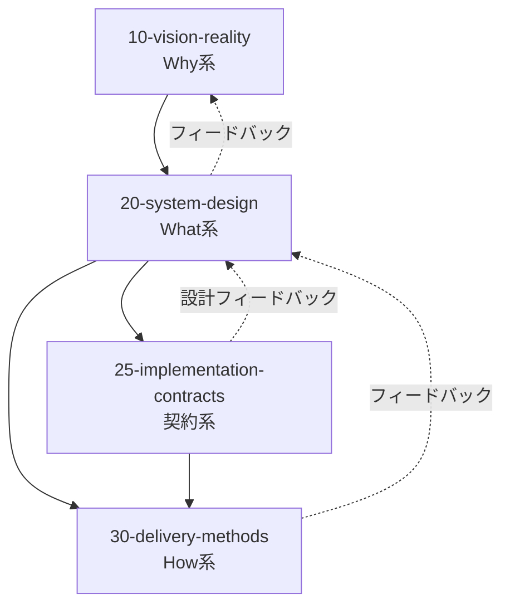
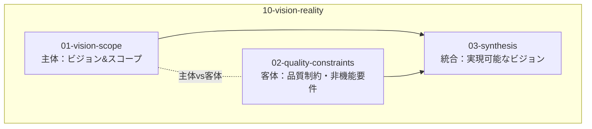
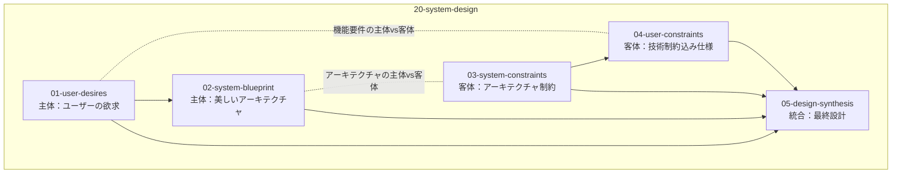
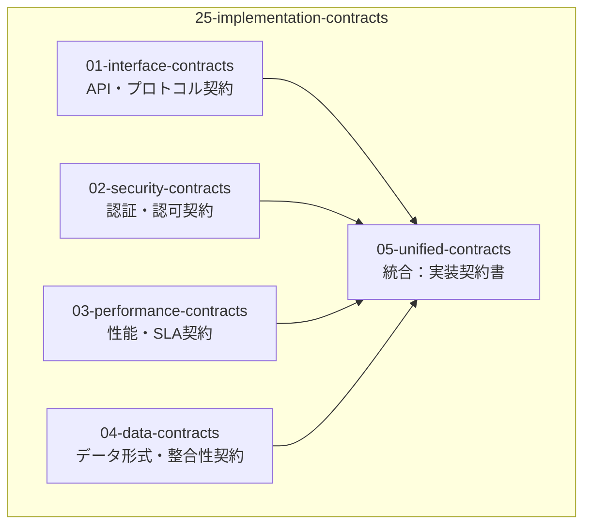
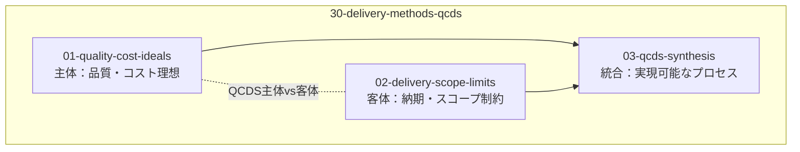
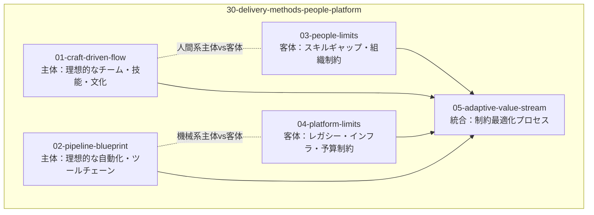
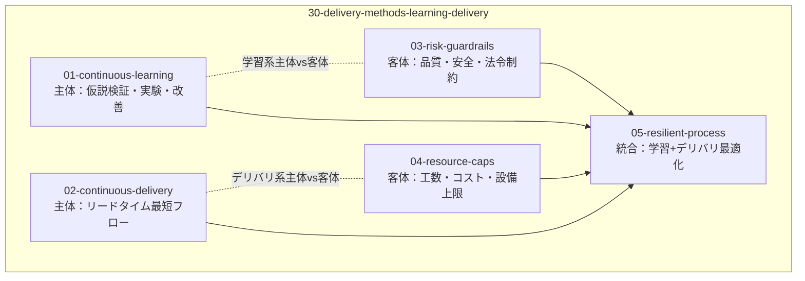
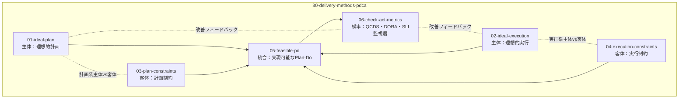

# CogitoWeave：LLM 統合デジタルツェッテルカステン

## 設計書体系概要とその論理的根拠

CogitoWeave の設計書は Why/What/How 軸による新しい 6 箱モデルに従って体系化されています。各設計判断は「1 ファイル 1 判断」原則に基づき細分化され、前提 → 論理 → 結論構造で整理されています。

理想と現実のペアによる 3 軸体系により、並行作業可能で柔軟性の高い設計書構造を実現しています。

## 構造と依存関係

### 1. 全体構造：箱間の依存関係

### 2. Why系内部：主体・客体・統合

### 3. What系内部：ユーザー・システム軸の正反合

### 4. 契約系内部：Design by Contract

### 5. How系内部：複数パターン

#### パターンA: QCDS分割モデル（個人開発向け）

#### パターンB: People/Platformモデル（チーム開発向け）

#### パターンC: Learning/Deliveryモデル（DevOps向け）

#### パターンD: PDCA二段モデル（改善重視組織向け）

## Why系における設計判断 - なぜ作るのか

Why系では「なぜ CogitoWeave を作るのか」という根本的な問いに対して、理想と現実の対比で答えています。[10-vision-scope](10-vision-scope/)では問題解決と価値創造の理想を描き、[11-quality-constraints](11-quality-constraints/)では制約と非機能要件という現実を扱います。

### 10-vision-scope：理想 - ビジョン&スコープ

個人知識管理の課題解決を目的とした LLM 統合デジタルツェッテルカステンの問題意識・プロダクトビジョン・設計原則を定義。Martin Fowler の Bliki 思想を LLM 時代にアップデートし、「LLM に作らせて、ツッコミを入れる」アプローチによる効率性と個性の両立を目指します。

以下の5つの典型的シナリオは、CogitoWeaveが解決すべき個人知識管理の具体的な課題と解決後の体験を示しています。

#### シナリオ 1: 気になる記事 → 自分なりの洞察

**小さな思想家の現状**: 「React のパフォーマンス最適化」という記事を Hacker News で見つけた。「面白そうだし、今のプロジェクトにも関係ありそう」と思ってブックマークしたが、後で読んでも「ふーん、そうなんだ」で終わってしまい、自分の知識として定着していない。

**CogitoWeave での体験**: 記事 URL を入力後、「この記事をどの概念の観点から読みたいか？」と聞かれる。自分の概念体系から「パフォーマンス最適化」を選択すると、LLM がその概念に関連する叩き台要約を生成。「あー、ここは自分の体験と違うな」「この部分は今のプロジェクトに使えそう」と思いながら補足・修正して、1つ目の文献メモが完成。さらに「React フック」の観点からも読み直して2つ目のメモを作成。1つの記事から複数の概念への学びが蓄積される。

#### シナリオ 2: 散らばった概念 → 整理された思考地図

**小さな思想家の現状**: 最近「リモートワーク」「非同期コミュニケーション」「チーム生産性」「個人の集中」といった概念について考えることが多いが、これらがどう関係しているのか頭の中で整理できていない。「なんとなく関係ありそう」は分かるが、その関係性を明確にできずにいる。

**CogitoWeave での体験**: 概念カードを KJ 法のように空間的に配置できる画面で、関連しそうな概念を近くに置いていく。「リモートワーク」と「非同期コミュニケーション」を近づけると「実現手段」の関係、「チーム生産性」と「個人の集中」を近づけると「目標と条件」の関係として整理される。最終的に自分なりの「リモートワーク成功の思考地図」が完成し、「そうか、個人の集中が確保されないとチーム全体の生産性も上がらないんだ」という洞察を得る。

#### シナリオ 3: ふとした疑問 → 関係性の発見

**小さな思想家の現状**: 「そういえば『デザインパターン』と『リファクタリング』って、どちらも『コードを良くする』話だけど、具体的にどう違うんだろう？」という疑問が浮かんだ。でも、この関係性を調べたり整理したりする適切な方法が分からず、疑問のまま放置してしまっている。

**CogitoWeave での体験**: 「デザインパターン」概念を選択し、関連しそうな概念として「リファクタリング」を入力。関係性として「設計改善手法」「適用タイミング」「効果範囲」などの個人的な関係語彙で意味付けできる。「デザインパターンは設計時、リファクタリングは改善時」「どちらも保守性向上が目標」といった自分なりの整理ができ、思考パターンが体系化される。

#### シナリオ 4: 質問への回答 → 過去の学びの活用

**小さな思想家の現状**: Stack Overflow で「React のパフォーマンス問題」について質問されている。自分も似たような経験があり、答えてあげたいが、「あれ、どこで読んだんだっけ？」「確か良い解決策があったはずだが...」と思い出せず、結局回答できずに終わってしまう。

**CogitoWeave での体験**: 質問内容をコピペすると、CogitoWeave が既存の個人概念体系から関連概念を検索候補として提示。「React パフォーマンス」「メモ化」「レンダリング最適化」など、自分が過去に作成・学習した概念からの検索結果が表示される。それらの概念に紐付いた過去の文献メモや自分の体験メモが表示される。「そうそう、この記事で読んだ useMemo の使い方！」「この時のプロジェクトでの失敗体験も参考になる」と思い出し、自分の体験に基づいた具体的で説得力のある回答を作成できる。

#### シナリオ 5: 漠然とした考え → 論理的な記事

**小さな思想家の現状**: 「最近のフロントエンド開発の複雑さについて」ブログ記事を書きたいと思っている。頭の中には「フレームワークの選択肢が多すぎる」「学習コストが高い」「でも生産性は上がっている」「個人開発と企業開発で事情が違う」などの断片的な考えがあるが、これを論理的な文章として構成できずにいる。

**CogitoWeave での体験**: 「フロントエンド開発」を中心概念として選択し、関連概念「フレームワーク選択」「学習コスト」「開発生産性」「個人 vs 企業」との関係を「課題要因」「トレードオフ」「文脈依存」として整理。これらの関係性が視覚的な思考マップとして表示され、各概念に紐付いた過去の学習メモや体験も参照できる。「課題提起 → 原因分析 → 解決提案 → 文脈別の使い分け」という論理構造で、自分なりの視点を持った記事を執筆できる。

### 11-quality-constraints：現実 - 品質制約

個人用途特化による認知負荷軽減と快適な操作体験を最優先とした品質制約を定義。段階的応答時間戦略、実行時・進化時品質特性の二軸戦略、外部システムとの相互運用性、個人用途に最適化された設計制約により、思考を中断されない知識管理環境を実現します。

## What系における設計判断 - 何を作るのか

What系では「何を作るのか」という問いに対して、[20-system-design](20-system-design/)でユーザーが本当に欲しいものの理想を描き、技術制約込みの実現可能な仕様という現実を扱います。

### 20-system-design：What系 - システム設計判断

#### UI 設計

- [UI 設計統合判断](20-system-design/01-user-desires/README.md) - 認知負荷軽減を重視した UI 設計判断体系
- [概念管理 UI](20-system-design/04-user-constraints/ui-design/ui-concept-grouping/) - 概念の統合・分割・操作制約
- [文献メモ作成 UI](20-system-design/04-user-constraints/ui-design/ui-literature/) - 概念中心アプローチによる文献メモ作成
- [グラフ可視化 UI](20-system-design/04-user-constraints/ui-design/ui-thought-map/) - デュアルモード・多次元コンテキスト表現
- [関係性入力 UI](20-system-design/04-user-constraints/ui-design/ui-relationship/) - 段階的発見・自然言語入力支援
- [タイムライン UI](20-system-design/04-user-constraints/ui-design/ui-timeline/) - 活動追跡機能

#### API 仕様

- [API 仕様](25-implementation-contracts/01-interface-contracts/api-specifications/README.md) - 技術制約込みの REST API 仕様

## How系における設計判断 - どう作るのか

How系では「どう作るのか」という問いに対して、[30-delivery-methods](30-delivery-methods/)で美しい理想的なアーキテクチャの理想を描き、実装・運用の制約という現実を扱います。

### 30-delivery-methods：How系 - 実装・運用方法

#### アーキテクチャ設計

- [論理アーキテクチャ](20-system-design/02-system-blueprint/arch-logical/) - 概念中心・3 層情報分離
- [開発アーキテクチャ](20-system-design/02-system-blueprint/arch-development/) - データ設計・インデックス戦略
- [シナリオアーキテクチャ](20-system-design/02-system-blueprint/arch-scenarios/) - GraphRAG・外部統合・ワークフロー

#### 機能要求・API 設計

- [機能仕様](20-system-design/04-user-constraints/functional-requirements/) - 詳細機能仕様
- [API 設計](25-implementation-contracts/01-interface-contracts/api-design/) - 内部 API 設計仕様

#### 実装・運用制約

個人用途での運用を前提とした Git 連携・運用手順を定義。シンプルな運用体制による長期メンテナンス性を重視します。

## 結論

Why/What/How 軸による新しい設計書体系により、CogitoWeave は並行作業可能な構造を実現しています。理想と現実の対比により、早期のフィードバックループが形成され、各軸で建設的な対話が生まれます。

Martin Fowler の Bliki 思想を LLM 時代にアップデートした本システムは、「LLM に作らせて、ツッコミを入れる」アプローチにより、効率性と個性の両立を実現する概念中心デジタルツェッテルカステンとして設計されています。

**核心的特徴**: 概念中心アプローチ・3 層情報レイヤー・認知負荷軽減・個人化コンテキスト(GraphRAG)

## 設計原則・体系管理

- [設計書体系原則](CLAUDE.md) - Why/What/How 軸・TDD 原則に基づく設計書管理方法

---

詳細な設計判断については上記の各ディレクトリを参照してください。
